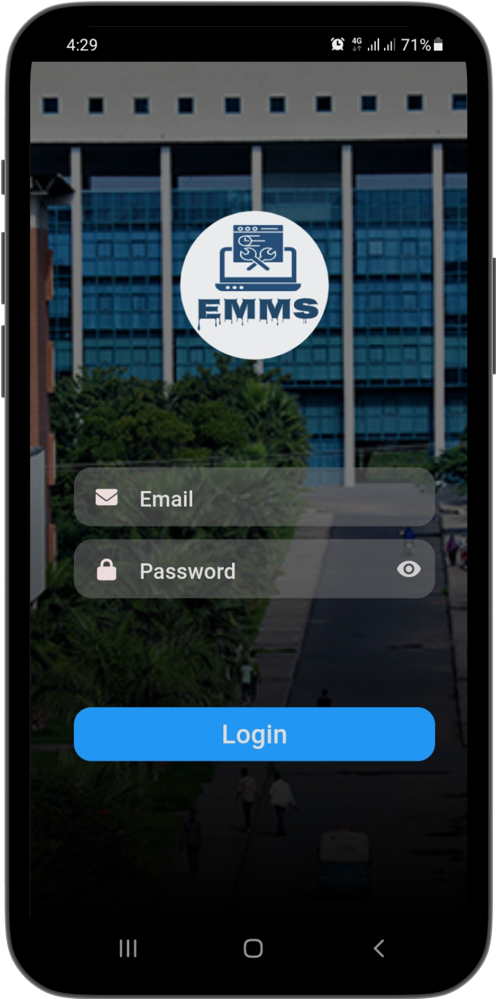
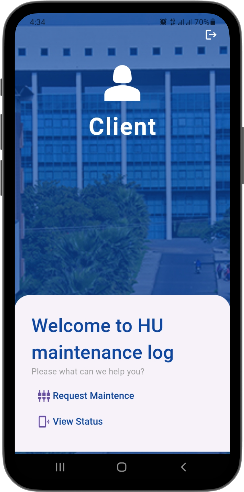
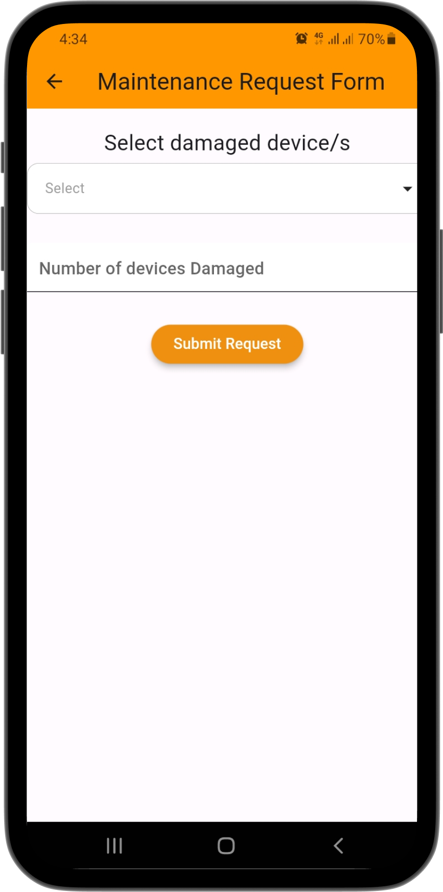
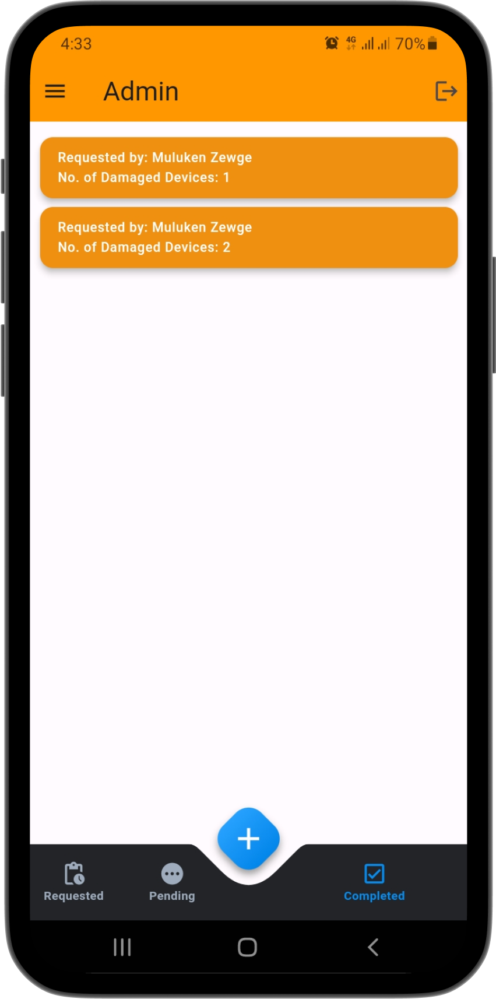
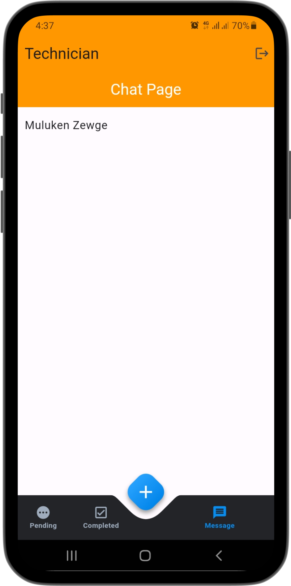
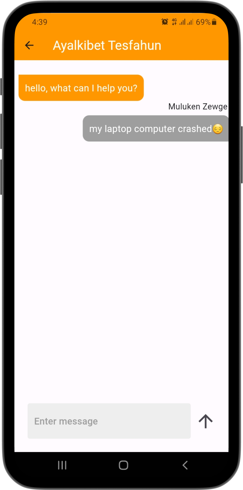

# EMMS

## Overview

This is a Flutter-based mobile application developed to digitalize the maintenance system at Hawassa University's ICT center. The application streamlines maintenance requests, approvals, task assignments, and communications by integrating roles for Admins, Clients, and Technicians.

## Project Description

The application leverages Google's Firebase Firestore for authentication and data storage, ensuring secure and efficient management of maintenance processes. Additionally, a real-time chat feature facilitates seamless communication between Clients and Technicians, enhancing collaboration and improving service delivery.

### Key Features by User Role:

#### Admin

- Add and delete user accounts.
- Approve maintenance requests.
- Assign Technicians to maintenance tasks.
- View the status of all tasks (Requested, Assigned, Completed).

#### Client

- Submit maintenance requests.
- Track request statuses (Requested, Pending, Completed).
- Access real-time chat with assigned Technicians once approved.
- Approve task completion after maintenance is performed.

#### Technician

- View assigned tasks.
- Communicate with the requesting Client through real-time chat after task assignment.
- Work on one task at a time (cannot be assigned multiple tasks simultaneously).

## Features

- **Role-based Functionality:** Supports three distinct user roles (Admin, Client, Technician) with unique permissions and workflows.
- **Firebase Integration:** Utilizes Firestore for secure user authentication and scalable data storage.
- **Real-Time Chat:** Enables smooth communication between Clients and Technicians for effective collaboration.
- **Task Management:** Tracks maintenance tasks through various statuses (Requested, Pending, Completed).
- **User-Friendly Interface:** Designed with Flutter for a responsive and intuitive user experience.

## Tech Stack

- **Frontend:** Flutter (Dart)
- **Backend:** Firebase Firestore
- **Authentication:** Firebase Authentication
- **Real-Time Communication:** Firebase Firestore (for chat)

## Screenshots

  
  

  
  

  
  

